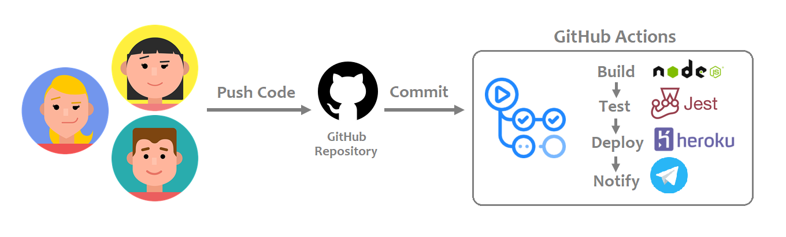

[](https://github.com/eyanlim/github-action-cicd/actions/workflows/main.yml)
<br>
<a href="https://eyan-nus-fintech-devops.herokuapp.com" target="_blank">
<a href="https://t.me/leydevopsproject" target="_blank">


# NUS FinTech Batch16 DevOps CI/CD Show & Tell
Implement a starter CI/CD pipeline using GitHub Actions to automate the build, test and deployment of a Node.js API to Heroku for every commit changes to the main branch.





## Technologies/Tools Stack
[](https://nodejs.org "Go to Node.js Official Site")
[](https://expressjs.com "Go to Express Official Site")
[](https://www.postman.com "Go to Postman Official Site")
[](https://git-scm.com "Go to Git Official Site")
[](https://github.com "Go to GitHub Official Site")
[](https://github.com/features/actions "Go to GitHub Actions page")
[](https://jestjs.io "Go to Jest Official Site")
[](https://www.heroku.com "Go to Heroku Official Site")
[](https://web.telegram.org "Go to Telegram Official Site")


## GitHub Actions Walkthrough
GitHub Actions contain workflow that is defined by YAML file. We have to define some components to make the automation works.

> In a nutshell, <strong>workflow</strong> is a configurable automated process. When triggered by <strong>event</strong>, workflow executes one or more <strong>jobs</strong>. The set of steps or <strong>actions</strong> which are defined in the jobs, are the frequently repeated tasks that we want to automate.

The CI/CD pipeline workflow for this demo is defined in `main.yml`. The workflow is triggered by every commits that are pushed to the main branch. Two jobs, namely build and deploy are created to automate the CI/CD processes. 

### Continuous Integration (CI) Job
- The first job `build` will setup the application code first, then run the test script. 
- To build the Node js app in actions, we use [`actions/setup-node@v2`](https://github.com/actions/setup-node) from the Marketplace.

    ```
    build:
        runs-on: ubuntu-latest    
        steps:
          # Checks-out your repository under $GITHUB_WORKSPACE, so your job can access it
          - uses: actions/checkout@v2
            name: Check out repository      

          - uses: actions/setup-node@v2
            name: Use Node.js
            with:
             node-version: '14.x'                

          - run: npm install
            name: Install dependencies

          - run: npm test        
            name: Run test
    ```
  
### Continuous Deployment (CD) Job
- The second job `deploy` is dependant on the first job. It will only run after `build` is executed successfully.

    ```
    deploy:    
        runs-on: ubuntu-latest
        needs: [build]
    ```

- To deploy the tested Node js application code to Heroku (a free cloud PaaS), we use [`akhileshns/heroku-deploy@v3.12.12`](https://github.com/AkhileshNS/heroku-deploy) from the Marketplace.

    ```
      - uses: actions/checkout@v2
      - uses: akhileshns/heroku-deploy@v3.12.12
        name: Deploy to Heroku
        with:
          heroku_api_key: ${{secrets.HEROKU_API_KEY}}
          heroku_app_name: ${{secrets.HEROKU_APP_NAME}}
          heroku_email: ${{secrets.HEROKU_EMAIL}}
     ```

- The last step would be sending a Telegram notification using [`appleboy/telegram-action@master`](https://github.com/appleboy/telegram-action) from the Marketplace.
    
    ```
      - uses: appleboy/telegram-action@master
        name: send telegram message on push
        with:
          to: ${{ secrets.TELEGRAM_TO }}
          token: ${{ secrets.TELEGRAM_TOKEN }}
          message: |
            ${{ github.actor }} created commit:
            Commit message: ${{ github.event.commits[0].message }}
            
            Repository: ${{ github.repository }}
            
            See changes: https://github.com/${{ github.repository }}/commit/${{github.sha}}
    ```
     
     
<div align="center">
  
<a href=".github/workflows"></a>
  
</div>

## Usage Guidelines
1. Clone this repository.
2. Install dependencies:
  
   ``` 
   npm install express
   npm install jest supertest --save-dev
   ```
  
3. The Node.js API comes with basic GET and POST endpoints without using any remote database connection or exception handling. Test the API endpoints on local machine first. You may use Postman to test the endpoints. Start the app with command `npm start`. These endpoints should return a response.
  
     <strong>GET</strong>
  
     `<YOUR_BASE_URL>/users/all`
  
     `<YOUR_BASE_URL>/users/<USER_ID>`
      
     <strong>POST</strong>
  
     `<YOUR_BASE_URL>/users/add`
  
4. A simple test script is created for this demo. Run test script with command `npm test`.

5. Setup a Heroku account and create a new app. Deploy to Heroku app with below commands and test the endpoints.
  
   ```
   heroku git:remote -a <YOUR-HEROKU-APP-NAME>
   git push heroku main
   ```
  
6. As required in Actions workflow, we need five Actions secrets. Secrets are encrypted environment variables and all repository collaborators can use these secrets for Actions. Add the Actions secrets in <strong>Settings > Secrets (on the left sidebar) > Actions > New repository secret</strong>. 
  - <strong>[HEROKU_API_KEY]</strong> Get your Heroku API key for authentication by going to <strong>Account settings > API Key > Reveal</strong>.
  - <strong>[HEROKU_APP_NAME]</strong> Heroku app name to use for deployment.
  - <strong>[HEROKU_EMAIL]</strong> Email address you used with Heroku.
  - <strong>[TELEGRAM_TOKEN]</strong> Follow these [four steps](https://www.siteguarding.com/en/how-to-get-telegram-bot-api-token) to get your Telegram bot API token.
  - <strong>[TELEGRAM_TO]</strong> This is the unique chat Id to receive messages from GitHub Actions. Run this method on browser to get the Id:
    
    ```    
    https://api.telegram.org/bot{YOUR_TELEGRAM_TOKEN}/getUpdates    
    ```
    

## References
1. [](https://github.com/u1i/devops-course)
2. [](https://github.com/jscheele/nusmoneysample)
